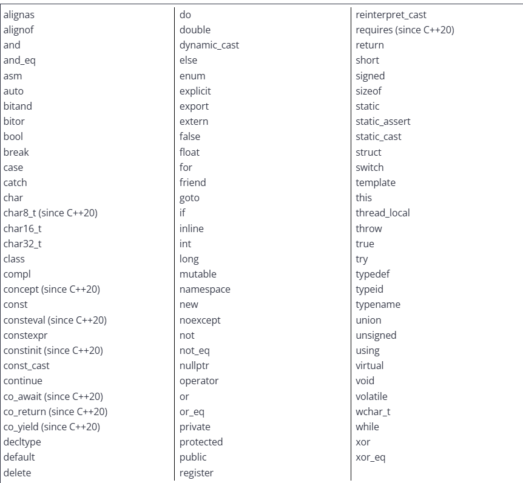

# Statements and structure of a program

## Statements

A computer program is a sequence of instructions that tell a computer what to do. A statement is a type of instruction that causes the program to perform some action.

Most(but not all) statements in C++ end in a semicolon (;).

## Functions and the main() function
Statements are typically grouped into units called functions. A function is a collection of statements that get executed sequentially (in order, from top to bottom). 

When the program is run, the statements inside of main are executed in sequential order. 
- Every C++ program must have a special function named main()

## Characters and text
The earliest computers were designed primarily for mathematical calculations and data processing. As hardware improved, computers also became valuable tools for written communication.

In written language, the most basic unit of communiciation is the character. A character is a written symbol or mark, such as a letter, digit, punctuation mark, or mathematical symbol. When we tap an alphabetic or numeric key on our keyboard, a character is produced as a result, which can then be displayed on the screen.

A sequence of characters is called text (or string in programming contexts)

Let's look at an example of a simple program, "Hello world"
```C++
#include <iostream>

int main()
{
    std::cout << "Hello world!";
    return 0;
}
```

Here we are declaring the type of our function, main(), and we are saying that main should return the value of an integer (which it does at the end). Before that occurs however, we want the function to print the statement "Hello world!", which is done by using std::cout, pronounced as C-out, which prints a value to the terminal.

The #include preprocessor directive (which is a special type of line), indicates that we would like to use the contents of iostream library, which is part of the C++ standard library that allows us to read and write text from/to the console. This is necessary to use std::cout.

# Comments

## Single-line comments

The // symbol begins a C++ single-line comment, which tells the compiler to ignore everything from the // symbol to the end of the line. For example:
```C++
std::cout <<"Hello world!"; //Everything from here to the end of the line is ignored, since it is a comment.
```

Having comments to the right of a line can make botht he code and the comment hard to read. 

However if the lines are long, placing comments to the right can make your lines really llong. In that-case, single line comments are often placed right above your code or the line it is commenting.


## Multi-line comments
/* and */ are a pair of symbols used to make multi line comments. Everything between the two symbols are ignored. For example:
```C++
/* 
This is a multi-line comment
This line will be ignored
And so will this one.
*/
```

Muilti line comments cannot be nested. So do not use multi-line comments inside other multi-line comments, wrapping single-line comments inside a multi-line comment is okay however.

## Proper use of comments
Typically comments should be used for three things

- First, for a given library, program, or function, commenst are best used to describe what the library, program, or function, does. These are typically placed at the top of the file or library, immediately preceding the function.

- Second, within a library, program, or function, comments can be used to describ ehow the code is used to accomplish its goal.

- Third, at the statement level, comments should be used to describe why the code is doing something. A bad statement code explains what the code is doing. If you ever write code that is so complex that needs a comment to exaplain what a staement is doing, you probably need to rewrite your statement, not comment it.

# Introduction to objects and variables

## Data and values

### Data

In computing, data is any information that can be moved, processed, or stored by a computer.

A program can acquire data to work with in many ways: from a file or database, over a network, from the user providing input on a keyboard, or from the programmer putting data directly into the source code of the program itself.

In the "Hello world" program from the aforementioned lesson, the text "Hello world!" was insterted directly into the source code of the program, providing data for the program to use. The program then manipulates this data by sending it to the monitor to be displayed.

### values
In programming, a single piece of data is called a value (sometimes called a data value).

Some common examples of values are:
- numbers
- characters
- text

## Random Access Memory

The main memory in a computer is called Random Access Memory (RAM). When we run a program, the operating system loads the program into RAM. Any data that is hardcoded into the program itself (such as text) is loaded at this point.

The operating system also reserves some additional RAM for the program to use while it is running. Commun uses for memory are to store values entered by the user, to store data read in from a file or network, or to store values calculated while the program is running so they can be used again later.

Ram is sort of like a series of numbered boxes that can be used to store data while the program is running.

In some older programming languages, you could directly access these boxes.

## Objects and variables
In C++ direct memory access is discouraged. Instead we access memory indirectly through an object. An object represents a region of storage (typically a RAM or CU regist) that can hold a value. objects have associated properties as well.

How the compiler and operating system work to assign memory to objects is beyond the scope of this lesson and a little too advanced. But essentially, instead of saying "go get the value stored in mailbox number 7532" it says "go get the value stored by this object" and let the compiler figure out where and how to retrive the value.

This means we can focus on using objects to store and retrive values, and not have to worry about where in memory those objects are actually being placed.

## Variable Definition

In order to use  variable, we need to tell the compiler that we want one. The most common way to do this is by use of a special kind of declaration statement called a definition.

An example is defining a variable named x:
```C++
int x; //define a variabled named x (of type int)
```

At commpile-time (when the program is being compiled), when encountering this statement, the compiler makes a note to itself that we want a variable with the name x, and that variable has the data type of int.

The compiler hanles all the other details aboutthis variablle for us, including determining how much memory the object will need, in what kind of storage the object will be placed (e.g. RAM or CPU register), where it will be placed relative to other objects, when it will be created and destroyed, etc.

A variable created via a definition statement is said to be defined at the point where the definition statement is placed. Usually, that's inside of main, but it can be in other functions and files as well.

## Variable creation

At runtime (when the program is loaded into memory and ran), each object is given an actual storage location (such as RAM or a CPU register) that it can use to store values. 

The process of reserving storage for an object's use is called allocation. 

Once allocation has occurred, the object has been created and can be sued.

Let's say that variable x is instantiated (created) at memory locaiton 140. Whenever the program uses variable x, it will access the value in the memory location 140. 

Then when the program is ran, execution starts at the top of main(), and memory for x is allocated. Then the program ends.

## Data types
A data type (more commonly just called a type) determines what kind of value the object will store.

There are plenty of data types in C++, the most common ones being:

- int (integers)
- double (decimals(often referred to as floaters))
- char (singular characters(i.e. "a" or "1"))
- std::string (groups of characters (i.e. "Hello))
- bool (True or False conditions)

## Defining multiple variables

It is possible to define multiple variables of the same type in a single statement by separating the names with a comma:

```C++
int a, b;
```

# Variable assignemnt and initialization

## Variable assignment
After a variable has been defined you can assign a value to it using the = operator.

This process is called assignment.
```C++
int width;
width = 5; //Now the variable width has the value of type integer, 5
```

## Variable initialization

You can combine the two steps of defining and assigning a variable. The process of specifying an initial value for an object is called initialization, and the syntax used to initialize an object is called an initializer. 

For instance:
```C++
#include <iostream>

int main()
{
    int width {5};
    std::count << width //prints 5
    return 0;
}
```

## Different forms of initialization

There are 5 common forms of initialization in C++:

```C++
int a; //default (no initializer)

//Traditional initialization forms:
int b = 5; //copy initialization 
int c (6); // direct-initialization

//Modern initialization forms (preferred):
int d { 7 }; //direct-list-initialization
int e {}; // value-initialization (empty braces)
```

### Default-initialization

When no initializer is provided, this is called default initialization. In many cases default-initialization performs no initialization, and leaves the variable with an inderterminate value (a value that is not predictable, sometimes called a "garbage value")

### Copy-initialization
When an initial value is provided after an equals sign, this is called copy-initialization.

This method copies the value on the rigth hand sign of the equals into thev ariable being created on the left hand side. 

Copy initilization had fallen out of favor in modern C++ due to being less efficient than other forms of initilization for some complex types. But some people still use it as C++17 remedied the bulk of these issues.

### Direct-initialization
Direct-initialization was initally introduced to allow for more efficient initialization of complex objects (those with class types). It also sort of fell out with modern C++ but its coming back allegedly

### List-initialization
The modern way to initialize objects in C++ is to use a form of initializtion that makes use of curly braces. This is called list-initialization (or uniform initilaization or brace initialization).

List-initialization comes in two forms:
```C++
int width { 5 }; // direct-list-initialization of initial 5 into variable width (preferred)

int height = { 6 }; //copy-list-initialization of initial value 6 into variable height (rarely used)
```

#### List-initialization disallows narrowing conversions

One of the primary benefits of list-initializations for new C++ progarmmers is that "narrowing conversions" ar disallowed.

This means if you try to list-initialize a variable usign a value that the variable can not safely hold, the compiler is required to produce a diagnostic (compilation error or warning) to notify you.

### Value-initialization and zero-initialization

When a variable is initialized using an empty set of braces, a special form of list-initializationc alled value-initialization takes place. In most cases, value-initialization will implicitly initialize the variable to zero (or whatever value is closest to zero for a given type). 

In cases where zeroing occurs, this is called zero-initialization.

## Overview

### List-initialization is the preferred form of initialization in modern C++

List-initialization (including value initialization) is generally preferred over the other initialization forms because it works in most cases.

### Initialize your variables

Initialize your variables upon creation. You may eventually find cases where youw ant to ignore this advice for a specific reason, and thats okay, as long as the choice is made deliberately.

### Instanation
The term instanation is a fancy word that means a variable has been created (allocated). An instantiated object is sometimes called an instance.

### Initializing multiple variables

You can initialize multiple variables like so:

```C++
int a=5, =6;
int c( 7 ), d ( 8 );
int e { 9 }, f{ 10 }l
int i {}, j{};
```

### Unused initialized variables warnings

Compilers will raise an error if you initialize a variable but never use it (since this is rarely desireable)

There are a few easy ways to fix this

- Remove the definition or comment it out

- Use the variable somehwere

#### The [[maybe_unused]] attribute

In some cases, neither of the above options are desirebale.

To address such cases, C++17 introduced the [[maybe-unused]] attribute, which allows us to tell the compiler that we're okay with a variable being unused.

# Introduction to iostream: cout, cin, and endl

## The input/output library

The input/output library (io library) is part of the C++ standard library that deals with basic input and output. We'll use the functionality in this library to get input from the keyboard and output to the data console. The io part of iostream stands for input/output.

### std::cout

std::cout allows us to send data to the console to be printed as text. 
- cout stands for "character output"

Example:
```C++
#include <iostream> //for std::cout

int main()
{
    std::cout << "Hello world!"; //print Hello world! to console
    
    return 0;
}
```
In the above example, we have included iostream so we have access to std::cout. We use std::cout with its insertion operator (<<), to send the text "Hello world!" (or any value outside of this specific program's context) to the console to be printed.

### Using std::endl to output a newline

Separate output stamenets do not result in separate lines of output on the console. So that means...
```C++
# include <iosteram> //for std::cout

int main()
{
    std::cout"Hello"
    std::cout"My name is arrstone"
    
    /* Together these would print: 
    HelloMy name is arrstone
    */
}
```
If we want to print separate lines of ouptut onto the console we need to tell the console to move the cursor to the next line. We can do that by outputting a newline.

- A newline is an OS-specific character or sequence of characters that moves teh cursor to the start of the next line.

Example:
```C++
#include <iostream> //for std::cout and std::endl

int main()
{
    std::cout << "Hi!" << std::endl, //std::endl causes the cursor to move to the next line

    std::cout <<"My name is Alex." << std::endl

    return 0;

    /* This is what the program prints:
    Hi!
    My name is Alex.

    */
}
```

### std::cout is buffered

std::cout is buffered, meaning that C++ statements that request outputs to the console are typically not sent to the console immediately. Instead the requested output "gets in line", and is stored in a region of memory set aside to collect such requests (called a buffer)
- Periodically, the buffer is flushed, meaning all of that data collected in the buffer is transferred to its destination (in this case the console)

### std::endl vs \n

Instead of using std::endl, you could just use "\n", which represents a newline.

std::endl actually does two things, it flushes the buffer (which is slow), AND it moves the cursor, which makes it inefficient.

Sot o output a newline without flushing the output buffer, we can just use \n

### std::cin

We've talked a lot about outputs, but what about inputs?

std::cin reads input from keyboard, and typically uses the extraction operator >> to put the input data in a variable.

Example:
```C++
#include <iostream>

int main()
{
    int number {};
    std::cout << "Enter Number";

    std::cin >> number;
    std::cout << number;
}
```

#### std::cin is buffered

std::cin is also buffered. Outputting data is a two step process

- The individual characters you enter as input are added to the end of an input buffer. The enter key is also stored as a '\n' character.

- The extraction operator '>>' removes characters from the front of the input buffer and converts them into a value that is assigned (via copy-assignment) to the associated variable. This variable can be used in subsequent statements.

Let's show an example:
```C++
#include <iostream>  // for std::cout and std::cin

int main()
{
    std::cout << "Enter two numbers: ";

    int x{};
    std::cin >> x;

    int y{};
    std::cin >> y;

    std::cout << "You entered " << x << " and " << y << '\n';

    return 0;
}
```
If you were to run this program and type "4" for the first input and then "5" for the second input, then the operation would run properly and would print "You entered 4 and 5"

However, if you type "4 5" in the first input, then by the time the second input runs, it won't wait for your input. Instead the 5 that is still in the input buffer is extracted to variable y. The program then prints "You entered 4 and 5".

# Uninitialized variables and undefined behavior

## Uninitialized variables

A varibale that has not been given a known value is called an uninitalized variable.

Using the values of uninitalized variables can lead to unexpected results.

Most modern compilers will attempt to detect if a variable is being used without being given a value. Usually it will give an error.

## Undefined behavior

Using the value from an unitianlized variable is our first example of undefined behavior

Undefined behaviour (UB) is the result of executing code whose behavior is not well-defined by the C++ language.

## Implentation-defined behavior and unspecified behavior

A specific compiler and the associated standard library it comes witha re called implenetation (as these are what actually implement the C++ langauge).

in some cases, the C++ language standards allow the implentation to determine how some aspects of the language will behave, so that the compiler can choose a behavior that is efficient for a given platform. 

Behavior that is defined by the implentation is called implentation-defined-behavior. Implentation-defined behavior must be documented and consistent for a given implentation.

For instance:
```C++
#include <iostream>

int main()
{
    std::cout << sizeof(int) << '\n' //print how many bytes of memory an intvalue takes

    return 0;
}
```
On most platforms this will produce 4, but on others, it may produce 2.

Generally you want to avoid implentation defined behavior and unspecified behavior.

# Keywords and naming identifiers

## Keywords

C++ reserves a set of 92 words for its own use. These words are called keywords (or reserved words), and each of these keywords has a special meaning within the C++ language.

